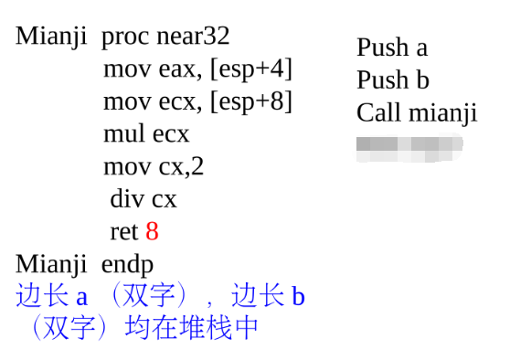
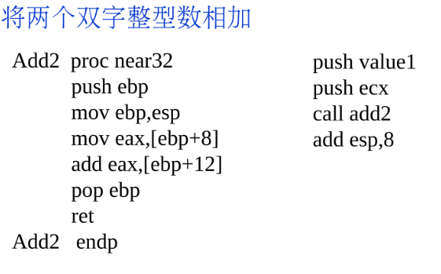

# 6.3 参数和局部变量

## 参数传递

类似函数，我们在编写过程中，有时需要传递参数。

传递参数的方法是在 call 之前将参数 push 进堆栈。

push 后 需要用 pop 释放栈空间，具体操作时有两种方法，我们以课件中代码为例。

### 法一 ret count

如图代码，右边是调用代码，左边是过程实现。

调用过程前，我们先 push 了两个参数 a 和 b ，随后 call mianji ，这时过程的返回地址又会压入栈，esp 指向的就是过程返回地址，我们可以通过 [esp] 方法来访问对应的栈中压入的参数。

在过程结束调用时，我们要把参数弹出，由于压入的是两个双字，我们 ret 8.

### 法二 add esp, count

例如这段代码，我们直接在外部操作 esp ，将他手动增加以“无视”两个双字整数。

## 局部变量

在过程中，使用 sub 指令强行操作栈的更低地址空间。